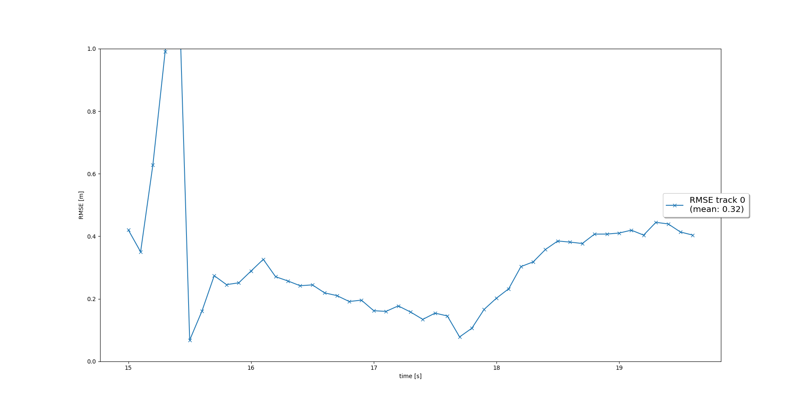

# Sensor Fusion Final
The following sections shortly summarizes the four tracking steps and the results achieved in each step 
## 1. Extended Kalman Filter
In the EKF part we implemented the prediction - update cycle of the EKF. In the first step we try to predict, based on the system matrix, what the state vector and state covariance looks like in the next timestep. In order to do this we had to define a system matrix **F** and noise covariance matrix **Q**.     
Prediction:  
> **x** = **F** * **x**   
**P** = **F** * **P** * **F**T + **Q** 

Then we calculate the Kalman Gain which decides whether we trust more in our prediction or the incoming measurement.  Based on the Kalman Gain we update our tracks and their covariances.  
Update:
> y = z - **H** * **x**  
**S** = **H** * **P** * **H**T + **R**  
**K** = **P** * **H**T * **S**-1  
**x** = **x** + **K** * y  
**P** = (**I** - **K** * **H**) * **P** 

Afterwards we loaded precomputed results from the Waymo Open Dataset and calculated the RMS between ground truth and EKF results as shown in the following image:
   

## 2. Track Management

## 3. Data Association

## 4. Camera - LiDAR Sensor Fusion