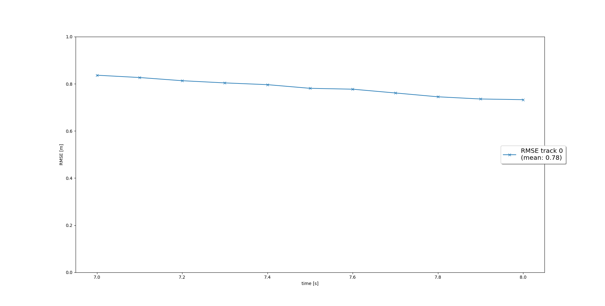

# Sensor Fusion Final
The following sections shortly summarizes the four tracking steps and the results achieved in each step 
## 1. Extended Kalman Filter
In the EKF part we implemented the prediction - update cycle of the EKF. In the first step we try to predict, based on the system matrix, what the state vector and state covariance looks like in the next timestep. In order to do this we had to define a system matrix **F** and noise covariance matrix **Q**.     
Prediction:  
> **x** = **F** * **x**   
**P** = **F** * **P** * **F**<sup>T</sup> + **Q** 

Then we calculate the Kalman Gain which decides whether we trust more in our prediction or the incoming measurement.  Based on the Kalman Gain we update our tracks and their covariances.  
Update:
> y = z - **H** * **x**  
**S** = **H** * **P** * **H**<sup>T</sup> + **R**  
**K** = **P** * **H**<sup>T</sup> * **S**<sup>-1</sup>  
**x** = **x** + **K** * y  
**P** = (**I** - **K** * **H**) * **P** 

Afterwards we loaded precomputed results from the Waymo Open Dataset and calculated the RMS between ground truth and EKF results as shown in the following image:
   


## 2. Track Management
This part comprises implementing all modules of the track management.  
* 1. Initializing new tracks based on measurement values: That is, the x,y,z coordinates of a new track are set to the measurement values and the velocity values of the state are set to 0 since we can not measure them with LiDAR (at least not based on one image). In order to compensate for the wrong velocity initialization we use large start values for the velocity covariances in P. The position part of P is initialized based on the measurement covariance we obtain from the LiDAR sensor.   
* 2. Implementing a logic to decrease the score for unassigned tracks, i.e., tracks for which no suitable measurement could be found. This part also includes a automatic deletion of track with low score or high covariance **P**. 


Resulting RMSE plot with track management for input sequence 2 and frames [65 - 100]:  
   


## 3. Data Association


## 4. Camera - LiDAR Sensor Fusion


## Difficulties
I had the following two problems with the score management:  
* Should we always increase the score of a track as long as a suitable measurement for this track is found. In the lessons we learned to use a sliding window and only take, e.g., up to 5 or 6 frames into account? As a consequence I only increase the score as long as it is < 1.2. But as explained in the next point, the score seems to have no effect for deletion anyway. 
* According to the provided code, if no vehicle is in the LiDARs FoV (meas_list is empty as shown in code below) we do not decrease any score values for we can not access the FoV. Therefore, objects that left our FoV can only be deleted based on large covariance values. This took me some time to understand. I guess in real world applications the situation would be different for we have a 360 degree view. Therefore if an object leaves our FoV it is either due to a large distance or it should be visible in the FoV of another sensor. All in all, I understood that true positives are in general deleted based on large covariances, while false positives should be quickly removed based on small scores.  
```
# decrease score for unassigned tracks
for i in unassigned_tracks:
    track = self.track_list[i]
    # check visibility    
    if meas_list: # if not empty
        if meas_list[0].sensor.in_fov(track.x):
            # your code goes here
            track.score = track.score - 1.0/params.window 
```