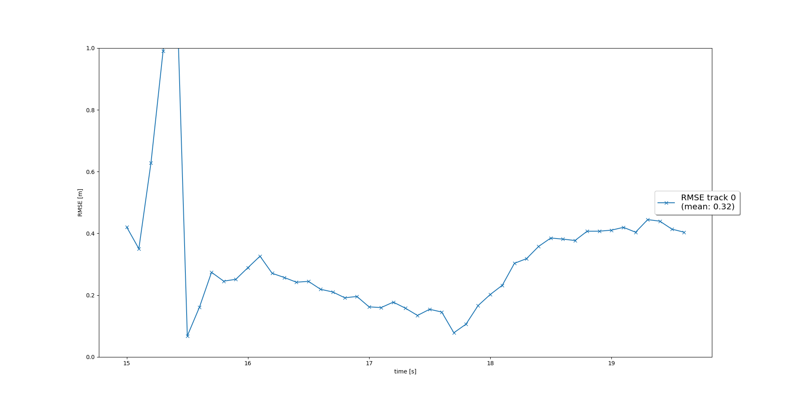
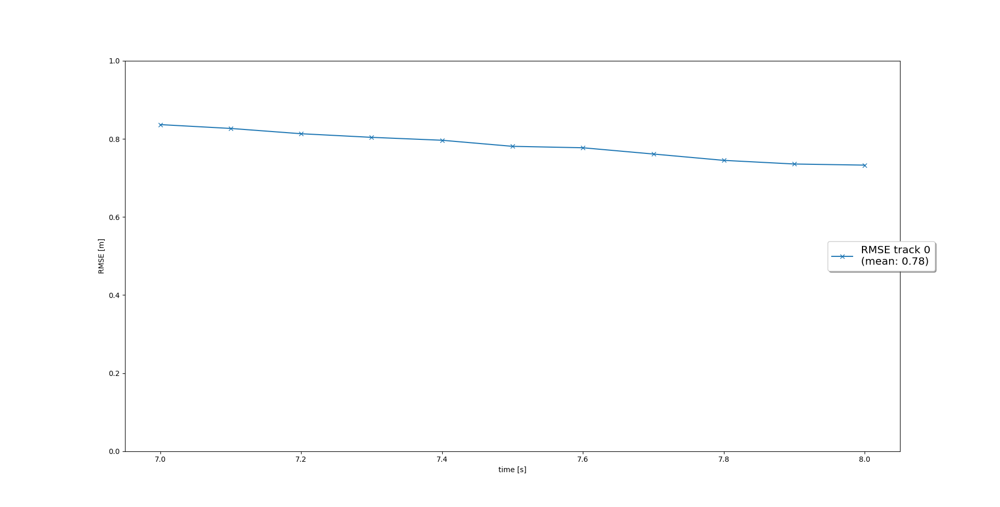
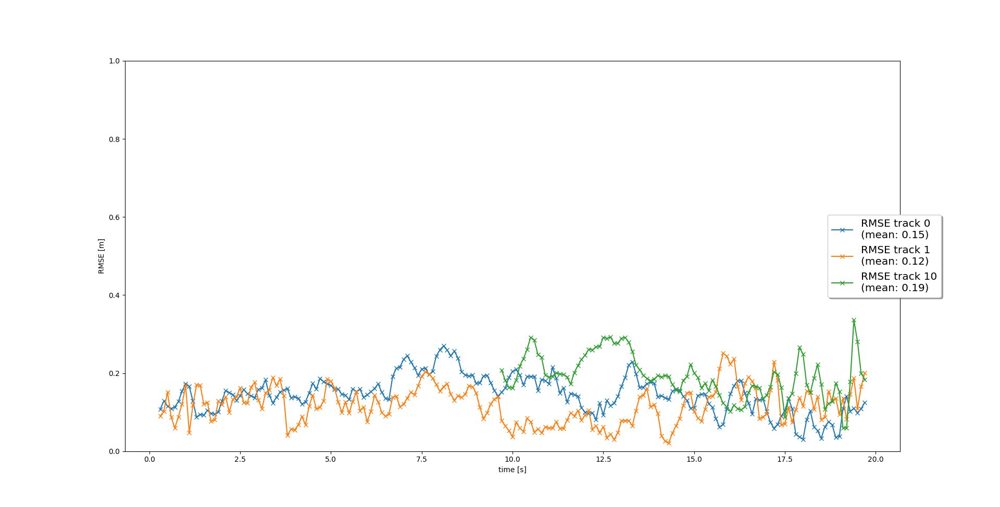
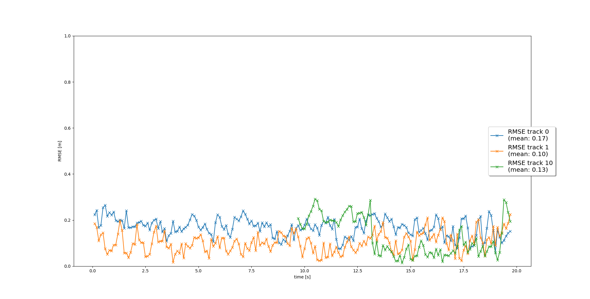

# Sensor Fusion Final

## Sensor Fusion Summary
The following sections shortly summarize the four tracking steps and the results achieved in each step. 
### 1. Extended Kalman Filter
In the EKF part we implemented the prediction - update cycle of the EKF. In the first step we try to predict, based on the system matrix, what the state vector and state covariance looks like in the next timestep. In order to do this we had to define a system matrix **F** and noise covariance matrix **Q**.     
Prediction:  
> **x** = **F** * **x**   
**P** = **F** * **P** * **F**<sup>T</sup> + **Q** 

Then we calculate the Kalman Gain which decides whether we trust more in our prediction or the incoming measurement.  Based on the Kalman Gain we update our tracks and their covariances.  
Update:
> y = z - **H** * **x**  
**S** = **H** * **P** * **H**<sup>T</sup> + **R**  
**K** = **P** * **H**<sup>T</sup> * **S**<sup>-1</sup>  
**x** = **x** + **K** * y  
**P** = (**I** - **K** * **H**) * **P** 

Afterwards we loaded precomputed results from the Waymo Open Dataset and calculated the RMSE between ground truth and EKF results as shown in the following image:
   


### 2. Track Management
This part comprises implementing all modules of the track management:  
1. Initializing new tracks based on measurement values: That is, the x,y,z coordinates of a new track are set to the location returned by the measurement, whereas the velocity values of the state are set to 0 since we can not measure them with LiDAR (at least not based on one image). In order to compensate for the wrong velocity initialization we use large start values for the velocity covariances in **P**. The position part of **P** is initialized based on the measurement covariance we obtain from the LiDAR sensor.   
2. Implementing a logic to decrease the score for unassigned tracks, i.e., tracks for which no suitable measurement could be found. This part also includes an automatic deletion of tracks with low score or high covariance **P**. The latter is the main deletion criteria for true positives, as explained in the section 'Difficulties'. 
3. Implementing a logic for increasing the tracks score and setting the tracks state based on score thresholds. As a first step we only distinguish the states: ['initialized', 'tentative', 'confirmed'] 

Resulting RMSE plot with track management for input sequence 2 and frames [65 - 100]:  
   


### 3. Data Association
The third part contains the data association problem of multi-target tracking. That is, we implement an association module which creates measurement - track pairs based on a specified metric (here single nearest neighbor SNN). As a result each measurement should be assigned to at most one measurement and remaining, unassigend measurements or tracks are stored in separate arrays.  
In order to create the associations **gating** is used to speed up the process.   
During the association process we create a matrix containing the Mahalanobis distances between all track - measurement pairs. With gating we exclude unlikely combinations by setting the corresponding matrix elements to infinity. Afterwards we iteratively assign one track to one measurement by searching for the minimum element in the matrix and pairing the corresonding track - measurement. As a consequence the row and column of the minimum element gets deleted and we also remove them from the unassigend lists. The loop terminates when the matrix is empty or only consists of infinity elements.  
The following plot shows the RMSE with implemented data association:  
   


### 4. Camera - LiDAR Sensor Fusion
The goal of this task is to include the camera measurements to improve the state and covariance updates.  
At first a function is implemented to check whether a track is in the sensors FoV. The result is used for the track score update, so we can decide whether a track is in the sensors FoV and therefore should get a score in-/decrease or if the track is not in the sensors FoV and therefore remains untouched.  
Next we implement the non-linear projection h(x), which transforms vehicle coordinates to the 2-D image coordinates of the camera sensor.   
The following plot shows the RMSE after including the camera measurements into the tracking algorithm:  
   
**Note:** The output video including all tracking results are stored under './media/'.


## Difficulties
I had the following two problems with the score management:  
* Should we always increase the score of a track as long as a suitable measurement for this track is found. In the lessons we learned to use a sliding window and only take, e.g., up to 5 or 6 frames into account? As a consequence I only increase the score as long as it is < 1.2, but did not implement a sliding window approach.  
But as explained in the next point, the score seems to have no effect for deletions of true positives and it is unlikely that a falso positive gets increased to values > 1.2. 
* According to the provided code, if no vehicle is in the sensors FoV (meas_list is empty as shown in code below) we do not decrease any score values for we can not access the FoV.  
Therefore, objects that left our FoV can only be deleted based on large covariance values. This took me some time to understand. I guess in real world applications the situation would be different for we have a 360 degree view. As a consequence, if an object leaves our FoV it is either due to a large distance or it should be visible in the FoV of another sensor. All in all, I understood that true positives are in general deleted based on large covariances, whereas false positives should be quickly removed based on small scores.  
```
# decrease score for unassigned tracks
for i in unassigned_tracks:
    track = self.track_list[i]
    # check visibility    
    if meas_list: # if not empty
        if meas_list[0].sensor.in_fov(track.x):
            # your code goes here
            track.score = track.score - 1.0/params.window 
```
Furhtermore, I wondered what would happen if we had only one false positive in a single measurement and the following measurements correctly return no detected objects?  
From the code above, I would assumen that the score value of the false positive would not be changed and the deletion would also be executed based on a large covariance **P**. 

## Benefits of Camera - LiDAR sensor fusion
In theory additional information, in the form of camera images, can only help to improve the performance of the overall tracking system.  
In the practical tracking example we implemented, the RMSE over all three vehicles goes down if camera measurements are taken into account, even though the difference is small. This can be seen in the following plots:  
RMSE for LiDAR only |  RMSE for LiDAR + Camera
:---------------------------------------------:|:-------------------------:
   |     
 


## Real world Challenges for a Sensor Fusion System
One real world challenge is the variety of different environments a Sensor Fusion system has to cope with. That is, different weather conditions like fog, snow, rain, light and also different scenes with a lot of different vehicle/object types. And under all conditions the results should be equally good and also computed in an equally short amount of time.    
Additionally, we only took two sensors into account, whereas a real world self-driving car would use many more sensors, which may result in timing problems.  
Like stated in the second task, in real world applications our assumptions are not always met. More precisely, we assumed zero-mean data input, but the LiDAR seems to return measurements with a constant y offset.  
Another challenge might be the time difference between consecutive measurements. In our example we used a constant delta t of 0.1s, whereas in real world applications I would expect that our fusion system would have to calculate the time difference for each prediction step. 


## Possible Improvements
By taking radar measurements into account the sensor fusion system would be able to directly measure the velocity components. I guess this would be benefitial for initialization and also the prediciton step, where we estimate new positions based on old location plus velocity.   
Another approach would be to fine tune the parameters of the Track Management module. Mainly the initial velocity values and the track score and state system. 

