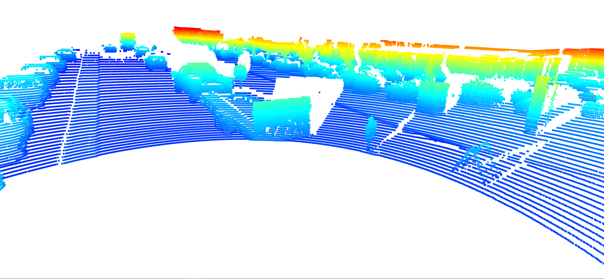
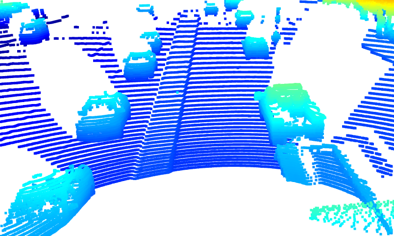
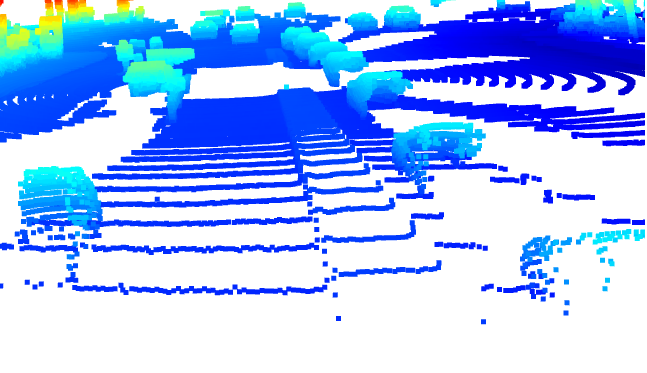
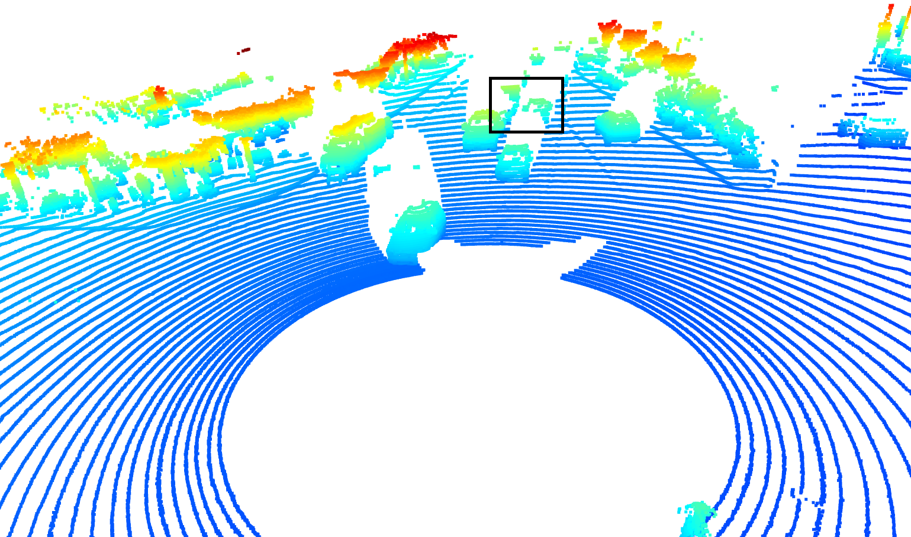
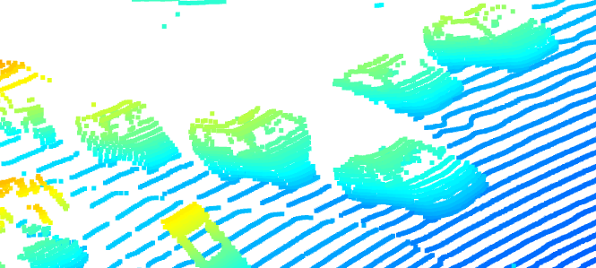
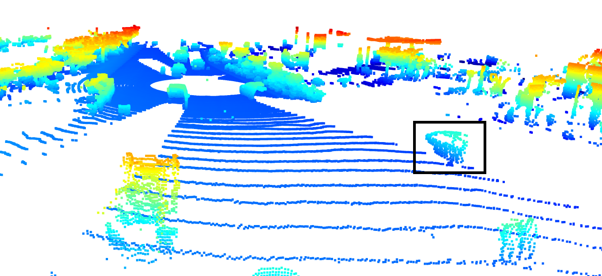

# Sensor Fusion Midterm
## Display 6 examples of vehicles with varying degrees of visibility in the point-cloud

The goal of this section is to analyse point clouds, mainly with respect to the reflectivity of vehicles.  
The first point cloud shows the starting image of sequence 3
   

The next two images compare two views of the same point cloud. One view in driving direction and the other from the opposite end and towards the ego vehicle. As expected only the object parts directed towards the ego vehicle are outlined in the point cloud. 
View in driving direction of ego vehicle  |  View against driving direction of ego vehicle
:---------------------------------------------:|:-------------------------:
   |    

Occlusion:  
The following image shows how the point cloud is affected by occlusion, that is, how objects can be (partially) blocked by other objects and therefore make the detection more complex.  
   
Windshield reflectivity:  
The next point cloud shows that the the vehicle body reflectivity is noticeably larger than windshield reflectivity.   
   
Reduced reflectivity at greater distances:   
The last screenshot serves to explain the effect of distance on the point cloud. As can be seen the point density is much smaller for objects with a larger distance to the LiDAR sensor.  
 

**Overall Conclusions:**  
* Vehicle body, including front and rear bumpers, has best reflectivity, whereas windshields and windows do not do not provide a good reflectivity
* One gets a good impression on the strengths and weaknesses of LiDAR: On the one hand LiDAR is very good at detecting objects even at large distances, but on the other hand LiDAR is only able to detect free space and unable to "see" the lanes, which is only possible with by detecting colors 